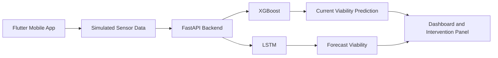

<div align="center">

# CellMonitor AI

### An AI-assisted monitoring and control simulation powered by synthetic bioreactor sensor data

[Türkçe](README.md) · English


</div>

---

## Overview

CellMonitor AI is a mobile monitoring prototype that simulates bioreactor cell-culture sensor streams and produces cell-viability estimates with two different machine-learning models.

The project is not connected to a physical industrial bioreactor. Its purpose is to demonstrate how machine-learning models, a REST API, mobile visualization, and control scenarios can be combined in a single end-to-end prototype.

---

## Key Features

- Fleet dashboard for monitoring four reactors
- Simulated pH, temperature, dissolved oxygen, glucose, lactate, and agitation data
- Current viability prediction with XGBoost
- Time-series forecasting with an LSTM model
- Reactor detail view with live charts
- Manual intervention scenarios
- Auto-Pilot simulation for rule-based control behavior
- Provider-based Flutter state management
- Prediction endpoints exposed through FastAPI

---

## Application Preview

<div align="center">


</div>

---

## Architecture



---

## Technology Stack

### Mobile Application

- Flutter
- Dart
- Provider
- HTTP
- Live charts and dashboard components

### Backend and Machine Learning

- Python
- FastAPI
- XGBoost
- TensorFlow / Keras
- LSTM
- Pandas
- NumPy
- scikit-learn
- joblib

---

## API Endpoints

```text
POST /predict_current
POST /predict_forecast
```

- `/predict_current`: Produces a current viability estimate from sensor readings.
- `/predict_forecast`: Produces a forecast from a short sensor-history sequence.

---

## Running the Project

### Backend

```bash
cd backend
pip install -r requirements.txt
python -m uvicorn main:app --reload
```

### Flutter

```bash
cd mobile_app/cellmonitor
flutter pub get
flutter run
```

API address for an Android emulator:

```text
http://10.0.2.2:8000
```

---

## Simulation Scenarios

- **Normal operation:** Stable sensor values and high viability
- **Warning state:** Degradation in pH, temperature, or oxygen
- **Critical state:** Low predicted viability and an intervention requirement
- **Manual intervention:** Add glucose, clear lactate, or boost oxygen
- **Auto-Pilot simulation:** Application-level corrective behavior based on defined thresholds

---

## Limitations

- Sensor data is synthetic.
- The project is not integrated with a physical bioreactor, valve, or industrial IoT system.
- The Auto-Pilot feature represents an in-app control simulation rather than a physical intervention.
- Model outputs have not been validated in a laboratory or production environment.
- This project was developed for learning, prototyping, and portfolio purposes.

---

## Goal

CellMonitor AI combines data simulation, machine learning, time-series forecasting, REST API development, and mobile dashboard design in a single end-to-end AI prototype.
