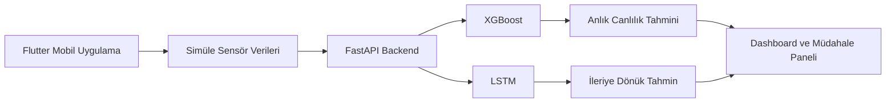

<div align="center">

# CellMonitor AI

### Sentetik biyoreaktör sensör verileriyle çalışan yapay zekâ destekli izleme ve kontrol simülasyonu

Türkçe · [English](README.en.md)


</div>

---

## Proje Özeti

CellMonitor AI, biyoreaktör hücre kültürü süreçlerini temsil eden **sentetik sensör verilerini** izleyen ve iki farklı yapay zekâ modeliyle hücre canlılığı tahmini üreten bir mobil kontrol paneli prototipidir.

Proje gerçek bir endüstriyel biyoreaktöre bağlı değildir. Amaç; yapay zekâ modellerinin, REST API'nin, mobil görselleştirmenin ve kontrol senaryolarının tek bir uçtan uca prototipte nasıl birleştirilebileceğini göstermektir.

---

## Temel Özellikler

- Dört reaktörü aynı anda gösteren filo paneli
- pH, sıcaklık, çözünmüş oksijen, glikoz, laktat ve karıştırma hızı simülasyonu
- XGBoost ile anlık canlılık tahmini
- LSTM ile zaman serisi tabanlı ileriye dönük tahmin
- Reaktör detay ekranı ve canlı grafikler
- Manuel müdahale senaryoları
- Otonom kontrol davranışını temsil eden Auto-Pilot simülasyonu
- Flutter Provider tabanlı durum yönetimi
- FastAPI üzerinden tahmin endpoint'leri

---

## Uygulama Görünümü

<div align="center">


</div>

---

## Mimari



---

## Teknoloji Yığını

### Mobil Uygulama

- Flutter
- Dart
- Provider
- HTTP
- Canlı grafik ve dashboard bileşenleri

### Backend ve Yapay Zekâ

- Python
- FastAPI
- XGBoost
- TensorFlow / Keras
- LSTM
- Pandas
- NumPy
- scikit-learn
- joblib

---

## API Endpoint'leri

```text
POST /predict_current
POST /predict_forecast
```

- `/predict_current`: Sensör değerlerinden anlık canlılık tahmini üretir.
- `/predict_forecast`: Kısa zaman serisi geçmişinden ileriye dönük canlılık tahmini üretir.

---

## Çalıştırma

### Backend

```bash
cd backend
pip install -r requirements.txt
python -m uvicorn main:app --reload
```

### Flutter

```bash
cd mobile_app/cellmonitor
flutter pub get
flutter run
```

Android emülatörü için API adresi:

```text
http://10.0.2.2:8000
```

---

## Simülasyon Senaryoları

- **Normal çalışma:** Stabil sensör değerleri ve yüksek canlılık
- **Uyarı durumu:** pH, sıcaklık veya oksijen değerlerinde bozulma
- **Kritik durum:** Düşük canlılık tahmini ve müdahale gereksinimi
- **Manuel müdahale:** Glikoz ekleme, laktat temizleme veya oksijen artırma
- **Auto-Pilot simülasyonu:** Belirlenen eşiklerde otomatik iyileştirme davranışı

---

## Sınırlılıklar

- Sensör verileri sentetiktir.
- Proje gerçek bir biyoreaktör, valf veya endüstriyel IoT sistemiyle entegre değildir.
- Auto-Pilot bölümü fiziksel müdahale değil, uygulama içi kontrol simülasyonudur.
- Model çıktıları laboratuvar veya üretim ortamında doğrulanmamıştır.
- Proje eğitim, prototipleme ve portföy amacıyla geliştirilmiştir.

---

## Amaç

CellMonitor AI; veri simülasyonu, makine öğrenmesi, zaman serisi tahmini, REST API ve mobil dashboard geliştirme becerilerini tek bir projede birleştiren uçtan uca bir yapay zekâ prototipidir.
